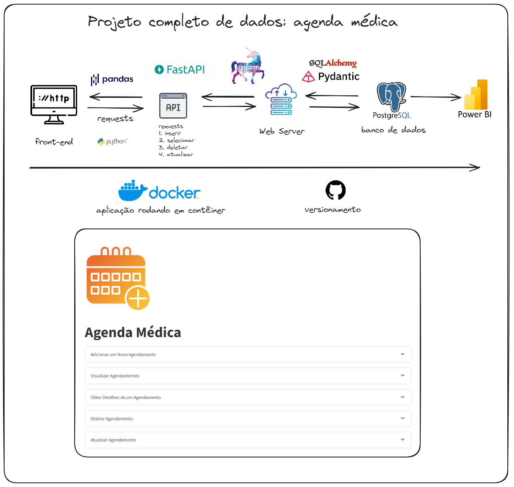

# CRUD Agenda Médica

Este projeto implementa um sistema de agenda médica utilizando a arquitetura Model-View-Controller (MVC) e várias tecnologias modernas, como FastAPI, SQLAlchemy, Pydantic, Docker e Streamlit.



## Estrutura do Projeto

O projeto segue a estrutura MVC:

- **Model:** Define a estrutura dos dados utilizando SQLAlchemy e Pydantic.
- **View:** Interface de usuário criada com Streamlit.
- **Controller:** Lida com as requisições HTTP usando FastAPI.

## Tecnologias Utilizadas

- **FastAPI:** Para a criação de APIs rápidas e performáticas.
- **Pydantic:** Para a validação de dados.
- **SQLAlchemy:** Para a ORM (Object-Relational Mapping) e interação com o banco de dados.
- **Streamlit:** Para a criação de interfaces de usuário interativas.
- **Docker:** Para a containerização dos serviços.
- **PostgreSQL:** Como banco de dados relacional.

## Instruções para Rodar a Aplicação

**Siga os passos abaixo para rodar a aplicação em seu computador:**

1. **Instale o Docker:**
   - Faça o download e instale o Docker a partir do [site oficial](https://www.docker.com/get-started).

2. **Clone este Repositório:**
   - Execute o comando `git clone <URL_DO_REPOSITORIO>` para clonar o repositório para sua máquina.

3. **Navegue até a Pasta do Projeto:**
   - Em seu terminal, navegue até a pasta raiz do repositório clonado.

4. **Execute o Docker Compose:**
   - Execute o comando `docker compose up` para iniciar todos os serviços definidos no `docker-compose.yml`.

### Comando `docker-compose up`

Quando você executa `docker-compose up`, o Docker Compose:

1. Lê o arquivo `docker-compose.yml`.
2. Cria e inicia os serviços especificados:
   - **Banco de Dados PostgreSQL:** Configurado com nome, usuário e senha fornecidos.
   - **Backend:** Construído e iniciado a partir do Dockerfile na pasta `backend`.
   - **Frontend:** Construído e iniciado a partir do Dockerfile na pasta `frontend`.

Os serviços serão conectados à rede `mynetwork`, e os dados do banco de dados serão persistidos no volume `postgres_data`.

Após a execução, você poderá acessar:

- **Backend:** `http://localhost:8000`
- **Frontend:** `http://localhost:8501`

## Uso

- **Frontend:** [Acesse o Frontend](https://agenda-medica-frontend.onrender.com/)
- **Documentação do Backend:** [Acesse a Documentação](https://agenda-medica-render.onrender.com/docs)

# Conclusões Gerais

Este projeto demonstra como integrar várias tecnologias para criar um sistema completo de agenda médica com backend, frontend e analytics.

## Estrutura de Pastas e Arquivos

```bash
├── README.md                # Documentação do projeto
├── backend                  # Pasta do backend (FastAPI, SQLAlchemy, Uvicorn, Pydantic)
│   ├── app                  # Código fonte do backend
│   ├── Dockerfile           # Dockerfile para o backend
│   └── requirements.txt     # Dependências do backend
├── frontend                 # Pasta do frontend (Streamlit, Requests, Pandas)
│   ├── app                  # Código fonte do frontend
│   ├── Dockerfile           # Dockerfile para o frontend
│   └── requirements.txt     # Dependências do frontend
├── assets                   # Assets como imagens e outros arquivos estáticos
│   └── esquema_do_projeto.png # Esquema do projeto
├── docker-compose.yml       # Arquivo de configuração do docker-compose (backend, frontend, postgres)
└── postgres                 # Configurações do banco de dados PostgreSQL
